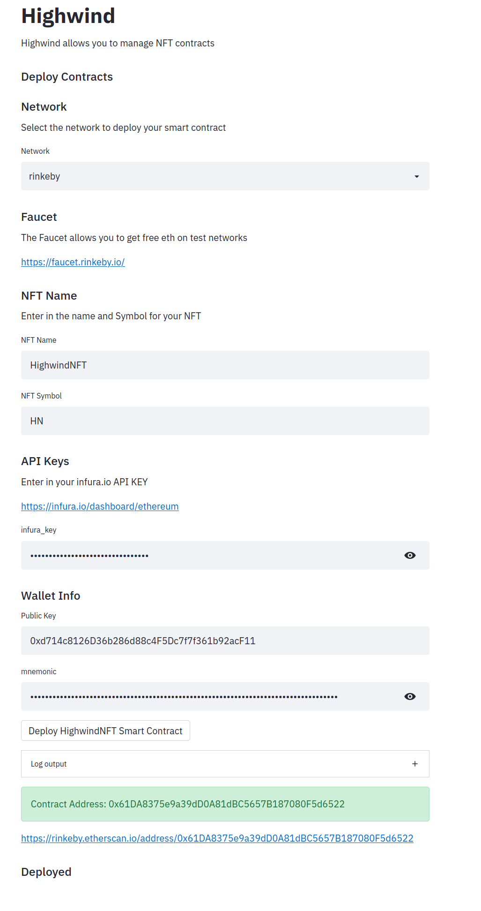
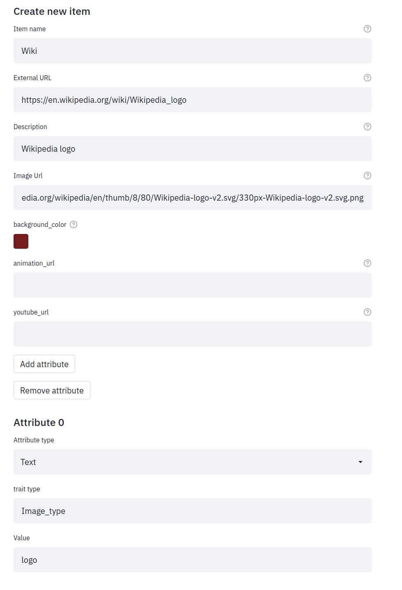
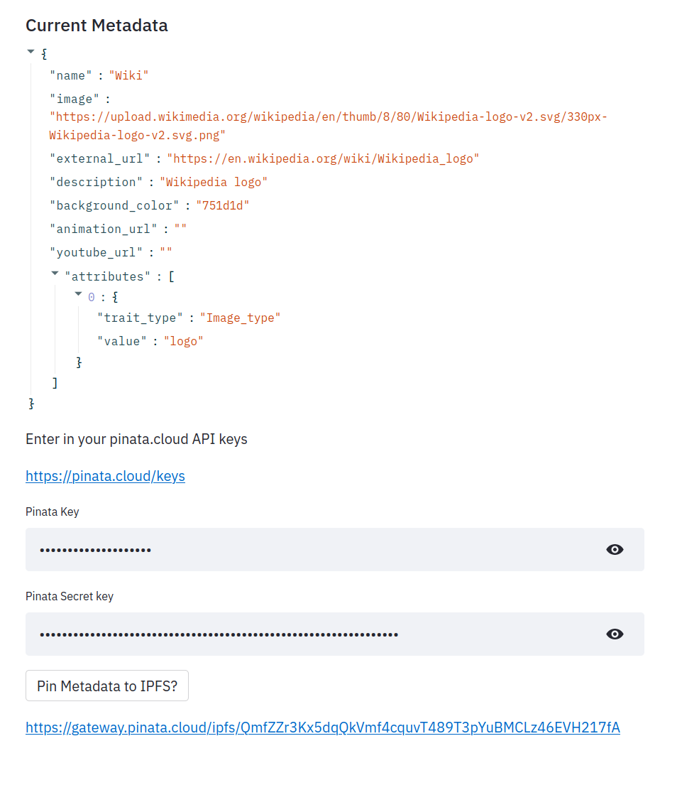
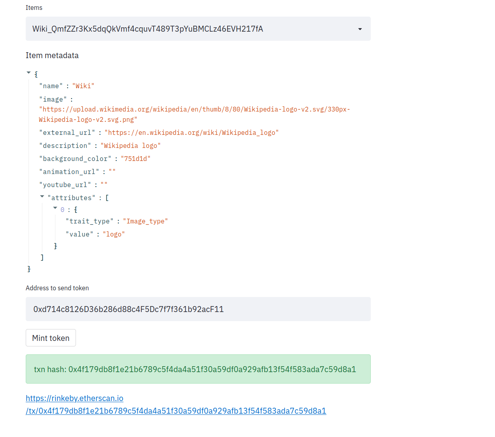
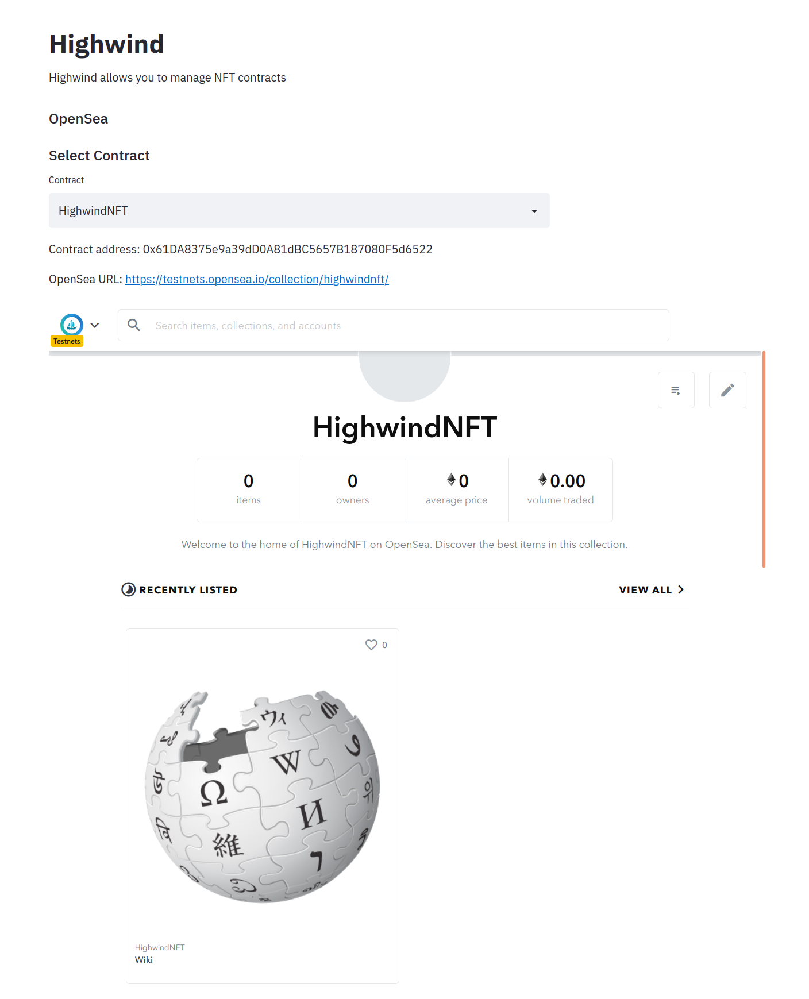

# Highwind

`Highwind` is a tool that allows you to deploy NFT smart contracts through a Graphic User Interface (GUI). With Highwind you can easily create and mint items that can be sold on [OpenSea](https://opensea.io/).

Leveraging Streamlit, Docker and web3 this tool is run on your local machine and works straight out of the box without any advanced configruation.



## Requirements

* docker (https://docs.docker.com/get-docker/)

### 3rd Party APIs

In order to streamline deployments, Highwind leverages these 3rd party APIs. You must register and get an API key from these services to use Highwind

#### Infura

[Infura](https://infura.io/) is a blockchain development suite that provides easy access to Ethereum networks.

#### Pinata

[Pinata](https://pinata.cloud/) provides an API to easily interact with [IPFS](https://ipfs.io/)

#### Metamask

[MetaMask](https://metamask.io/) is a software cryptocurrency wallet used to interact with the Ethereum blockchain.

## QuickStart

Here is how you can easily get started using Highwind

```bash
git clone https://github.com/banjtheman/highwind.git
cd highwind
./build_docker.sh
./run_docker.sh
# view website on localhost:8501
```

## Deploy

With Highwind you can deploy Smart Contracts easily just by entering in your wallet info and infura key. You will need to have some ETH/MATIC in your wallet depending on the network. The faucet links are displayed in the UI.


## Create Item

With Highwind, you can easily create item metadata that is uploaded to [IPFS](https://ipfs.io/) powered by [Pinata](https://pinata.cloud/). Simply enter in the infromation and press the Pin button





## Mint Item

Once you have created an item, you can now mint it on the blockchain. Enter the address you would like to send the NFT to, and press the mint button.



## View on OpenSea

Once items have been minted, you can view your collection and items on OpenSea. 



## Scripts

You can also run a standalone scripts to interact with NFTs

### Mint NFT

This script allows you to mint and NFT with a token metadata url from a contract, and send the NFT to an address.

You need to set some environment variables, and pass in arugments to get the script to work. Here is an end to end example
```
./build_docker.sh
./run_docker.sh
docker exec -it DOCKER_HASH
cd scripts/
export PUBLIC_KEY=PUBLIC_KEY
export PRIVATE_KEY=PRIVATE_KEY
export INFURA_KEY=INFURA_KEY
export NETWORK="mumbai"
python mint_nft.py --contract_address CONTRACT_ADDRESS --abi_path ABI_PATH --to_address TO_ADDRESS --token_metadata_url
```

Example runnning the script
```
python mint_nft.py --contract_address "0x6DF98FB9cDfDa02F7d0A53c544520A3a2f9E6eC8" --abi_path "../build/contracts_WitcherCoin/WitcherCoin.json" --to_address "0xd714c8126D36b286d88c4F5Dc7f7f361b92acF11" --token_metadata_url "ipfs://QmSjxUGeqbUSFL5KWwV1x9aGw7QfygmjDiqM2MLhJdr9kP"
```

Example output
```
INFO: Starting mint
INFO: checking if connected to infura...True
INFO: mint txn hash: 0xdf4cd44c67a81444493115f61a4213071d391ca48f8e8c5dcdb5456ccbc7bf17 
INFO: Got tokenid: 4
INFO: Scan url for token 4: https://explorer-mumbai.maticvigil.com/tx/0xdf4cd44c67a81444493115f61a4213071d391ca48f8e8c5dcdb5456ccbc7bf17 
```


If you want to mint a bunch of nfts can easily add in looping logic, but be weary of gas fees.